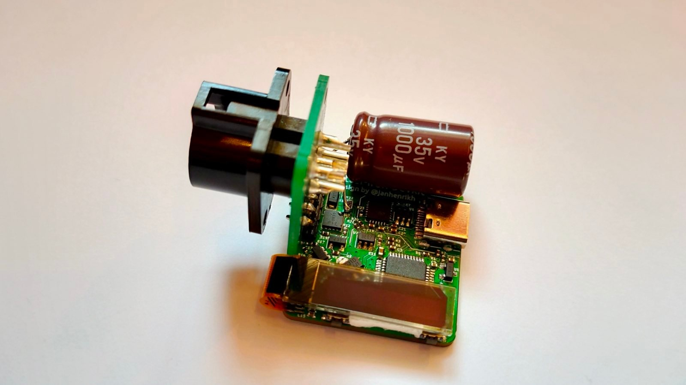
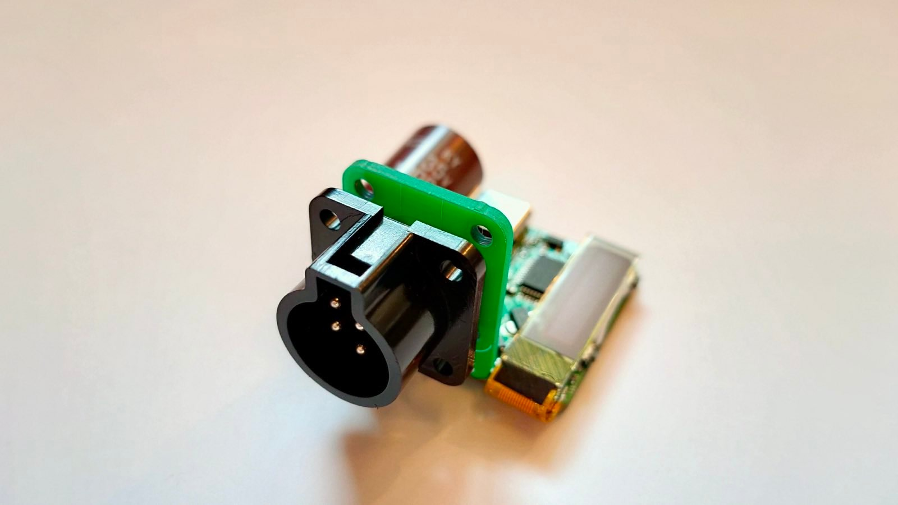
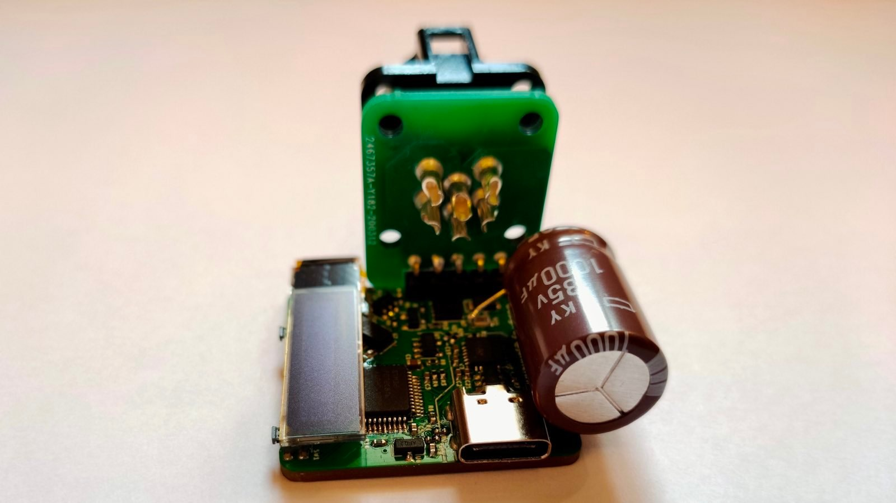
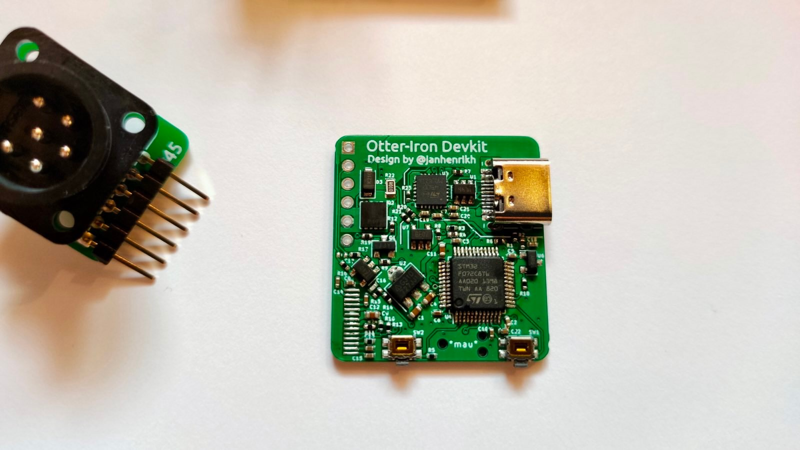

# Otter-Iron-PRO

USB-PD soldering station for JBC C245 handles based on the [Otter-Iron](https://github.com/Jana-Marie/Otter-Iron). More coming soon :)

 - v1.0 tested, works but not great
 - v1.1 untested, wont be tested
 - v2.0 tested, kinda works, could be much more stable

## Firmware

 - Requests and configures for USB-PD profile of 30 W or 80 W (allows variable).
 - Current limit automatically set based on PD profile available.
 - Profiles can be changed in firmware and enumerated profile will show at start up.
 - Prevents MOSFET driving if no/incompatiable USB-PD profile is advertised; allows setup/flashing with standard USB port.

## v2.0

## v1.0

